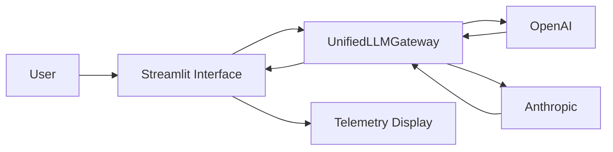

# Multi-Provider LLM Gateway

A Python application that provides a unified interface for interacting with multiple large language model providers.

The project currently supports:

- OpenAI
- Anthropic
- Real-time streaming responses
- Token usage tracking
- Time-to-first-token (TTFT)
- Tokens per second
- Request latency
- Estimated API cost
- Demo Mode for testing without paid API calls

---

## Project Architecture



---

## Project Structure

```text
multi-provider-llm-gateway/
├── src/
│   ├── __init__.py
│   ├── app.py
│   ├── gateway.py
│   ├── pricing.py
│   └── schemas.py
├── tests/
│   ├── __init__.py
│   ├── test_gateway.py
│   └── test_security.py
├── .dockerignore
├── .env.example
├── .gitignore
├── Dockerfile
├── README.md
├── ai_prompt_log.md
└── pyproject.toml
```

---

## Requirements

- Python 3.11+
- OpenAI Python SDK
- Anthropic Python SDK
- Pydantic
- tiktoken
- Streamlit
- FastAPI
- Uvicorn
- python-dotenv
- pytest
- pytest-asyncio
- Docker

---

## Setup

Create a virtual environment:

```bash
python3 -m venv .venv
```

Activate the virtual environment:

```bash
source .venv/bin/activate
```

Install the required dependencies:

```bash
pip install openai anthropic pydantic tiktoken fastapi uvicorn python-dotenv pytest pytest-asyncio streamlit
```

---

## Environment Variables

Create a `.env` file in the project root.

Example:

```text
OPENAI_API_KEY=your_openai_key_here
ANTHROPIC_API_KEY=your_anthropic_key_here
```

Never commit real API keys to GitHub.

The `.env` file is excluded from Git using `.gitignore`.

An example configuration is provided in:

```text
.env.example
```

---

## Running the Application

Run the Streamlit application:

```bash
python -m streamlit run src/app.py
```

Then open:

```text
http://localhost:8501
```

---

## Demo Mode

Demo Mode allows the application to run without making paid OpenAI or Anthropic API calls.

When Demo Mode is enabled:

- responses are simulated locally
- telemetry values are simulated
- no paid API calls are made
- the user interface and streaming behavior can still be demonstrated

Demo Mode is intended for local development, testing, and interface demonstrations.

---

## Telemetry

The application tracks the following metrics:

- Input tokens
- Output tokens
- Total tokens
- Time-to-first-token (TTFT)
- Total request latency
- Tokens per second
- Estimated API request cost

The final stream chunk contains the completed telemetry information.

---

## Pricing

The telemetry engine calculates estimated request cost using the following rates.

| Model | Input Cost / 1M Tokens | Output Cost / 1M Tokens |
|---|---:|---:|
| gpt-4o-mini | $0.15 | $0.60 |
| gpt-4o | $2.50 | $10.00 |
| claude-3-5-haiku | $0.80 | $4.00 |
| claude-3-5-sonnet | $3.00 | $15.00 |

Pricing values are stored in:

```text
src/pricing.py
```

Request cost is calculated separately for input and output tokens and rounded to six decimal places.

---

## Running Tests

Run the complete test suite with:

```bash
pytest -v
```

The test suite verifies:

- `StreamChunk` schema behavior
- normalized streaming chunk structure
- concatenation of streamed text
- telemetry sanity
- token-count tolerance
- request cost calculation
- unknown model handling
- authentication error behavior
- missing API key behavior
- API key protection
- custom gateway exception handling

---

## Security

The project includes several security protections:

- API keys are stored using environment variables
- `.env` is excluded from Git
- `.env` is excluded from Docker builds
- raw API keys are not written into application code
- provider exceptions are wrapped in custom domain exceptions
- user-facing errors do not intentionally expose API keys
- missing API credentials are handled without crashing the entire application

---

## AI-Assisted Development and Audit

The initial application was developed with AI assistance.

The generated code was manually reviewed for potential bugs, security risks, and asynchronous programming problems.

The audit focused on issues including:

- OpenAI streaming events with empty `choices`
- OpenAI chunks where `delta.content` may be `None`
- Time-to-first-token measurement
- asynchronous provider clients
- client reuse
- provider error handling
- API secret exposure

The full AI prompt and audit findings are documented in:

```text
ai_prompt_log.md
```

---

## Running with Docker

Build the Docker image:

```bash
docker build -t multi-provider-llm-gateway .
```

Run the container:

```bash
docker run --rm -p 8501:8501 multi-provider-llm-gateway
```

Then open:

```text
http://localhost:8501
```

The application can be demonstrated locally with Docker when cloud deployment or API-credit limitations prevent public hosting.

---

## Supported Models

The application is currently configured for:

### OpenAI

- `gpt-4o-mini`
- `gpt-4o`

### Anthropic

- `claude-3-5-haiku`
- `claude-3-5-sonnet`

---

## Technologies Used

- Python
- OpenAI SDK
- Anthropic SDK
- Pydantic
- Streamlit
- tiktoken
- pytest
- pytest-asyncio
- Docker
- Git
- GitHub

---

## Repository

GitHub Repository:

```text
https://github.com/anudariundrakh/multi-provider-llm-gateway
```

---

## Author

Anudari Undrakh