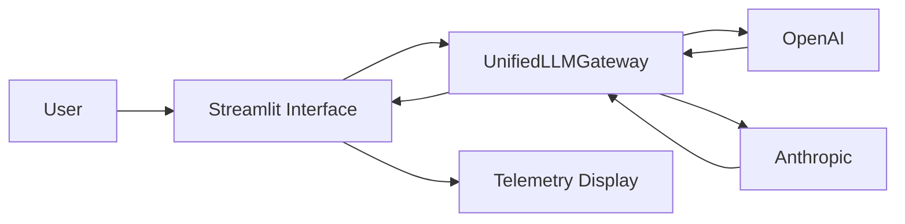

## Project Architecture



## Pricing

The telemetry engine calculates estimated request cost using the following rates.

| Model | Input Cost / 1M Tokens | Output Cost / 1M Tokens |
|---|---:|---:|
| gpt-4o-mini | $0.15 | $0.60 |
| gpt-4o | $2.50 | $10.00 |
| claude-3-5-haiku | $0.80 | $4.00 |
| claude-3-5-sonnet | $3.00 | $15.00 |

Pricing values are stored in:

```text
src/pricing.py
```

Request cost is calculated separately for input and output tokens and rounded to six decimal places.